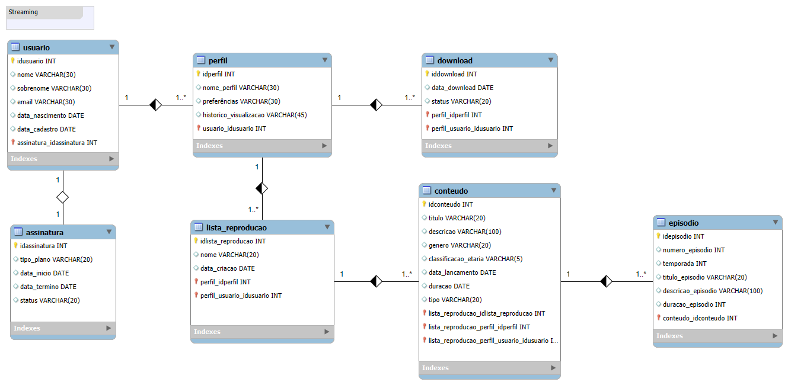

# Projeto Conceitual de Banco de Dados | Streaming de entrenimento audiovisual

O Streamify é um serviço de streaming que oferece uma ampla variedade de filmes, séries, documentários e programas originais. O objetivo é proporcionar entretenimento de alta qualidade para todos os gostos, com um catálogo em constante atualização. O Streamify utiliza algoritmos avançados para recomendar conteúdos baseados nas preferências dos usuários, garantindo uma experiência personalizada e envolvente.

O projeto Conceitual foi desenvolvido para o desafio de código proposto pela professora Juliana Mascarenhas, no bootcamp Inteligência Artificial Aplicada a Dados com Copilot da DIO em parceria com a Heineken. Nesse projeto a professora sugeriu a elaboração conceitual de um banco de dados para uma oficina, porém, para testar ainda mais meus conhecimentos adquiridos ao longo do bootcamp até o momento do desafio decidi escolher uma temática e o resultado desse desafio não poderia ter sido mais incrível.

## Estrutura do Banco de Dados

### Entidades

- Usuário: Armazena informações do usuário assinante da plataforma
  - Nome
  - Sobrenome
  - Data de nascimento
  - Data de Cadastro no sistema

- Assinatura: Armazena dados da assnatura do usuário
  - Tipo do plano
  - Data de Início
  - Data de Término
  - Status
  
- Perfil: Armazena dados de perfis criados pelo usuário na plataforma
  - Nome do perfil
  - Preferências (generos de interesse)
  - Histórico de visualizações

- Conteúdo: Armazena informações do conteúdo disponível na plataforma
  - Título
  - Descrição
  - Gênero
  - Classificação Etária
  - Data de Lançamento
  - Duração
  - Tipo

- Episódio: Armazena informações de cada episódio de um conteúdo do TIPO série
  - Título
  - Descrição
  - Duração
  - temporada
  - número do episodio

- Lista de Reprodução: Armazena informações das listas criadas pelo usuário 
  - Nome da Lista
  - Data de Criação

- Download: Armazena informações de arquivos baixados por determinado perfil
  - data de download
  - status

### Relacionamentos

- Um Usuário pode ter múltiplos Perfis.
- Um Perfil pode ter múltiplos conteúdos em lista e fazer múltiplos Downloads.
- Um Perfil pode ter múltiplas Recomendações associadas.
- Um Conteúdo pode ter múltiplos Episódios (no caso de séries).
- Um Perfil pode ter múltiplas Listas_de_Reprodução.
- Um Assinatura é associada a um único Usuário.

## Considerações Finais

A estrutura proposta contempla desde o gerenciamento de perfis e assinaturas até a organização de conteúdos e listas de reprodução, visando atender às diversas necessidades dos usuários. Pensar e elaborar esse projeto foi um ótimo desafio cujo foco seria a aprendizagem relaionada com a criação de diagramas conceituais de banco de dados.

## Tecnologias Utilizadas

- MySQL Workbench

## Diagrama

